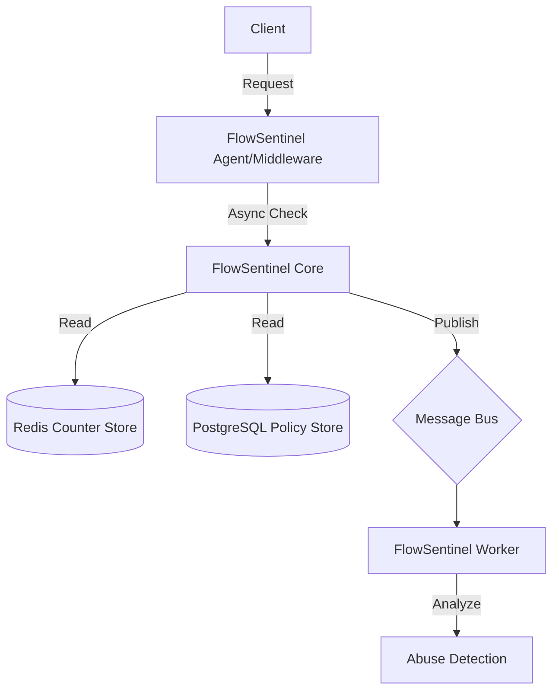

# 🚦 FlowSentinel

**Enterprise Rate-Limiting & Traffic Governance Platform**

  

## �️ Live Preview (Command Center)


### [👉 View Live Demo Dashboard](https://hunadi15.github.io/FlowSentinel/flowsentinel-main/src/FlowSentinel.Dashboard/index.html)
*(Note: Requires GitHub Pages to be enabled on the repository)*

---

## �📖 Introduction

**FlowSentinel** is a centralized traffic-control system for APIs and microservices. It is designed to act as a high-performance control plane that enforces rate limits, detects abuse patterns, and acts as a dynamic policy engine for distributed systems.

Unlike typical business applications, FlowSentinel is **infrastructure software**. It fills the gap between basic API gateway throttling and complex localized circuit breakers.

### 🧠 Why FlowSentinel?

*   **Centralized Control Plane**: Manage traffic policies across all your services from one place.
*   **Dynamic Intelligence**: Shift from static "100 req/min" rules to adaptive policies based on system health and anomaly detection.
*   **High Performance**: Built on .NET 8 Minimal APIs and Redis for sub-millisecond overhead.

---

## 🏗️ Architecture

FlowSentinel operates as a sidecar/middleware model with a centralized policy engine.



### Core Components

1.  **FlowSentinel.Gateway**: The API entry point for control plane operations.
2.  **FlowSentinel.Core**: The heart of the system containing the token bucket algorithms and policy evaluation logic.
3.  **FlowSentinel.Policy**: A dedicated engine for defining and parsing complex traffic rules (scope, window, limits).
4.  **FlowSentinel.Agent**: A lightweight SDK/Middleware for .NET services to hook into FlowSentinel.
5.  **FlowSentinel.Worker**: Background service for processing metrics, detecting anomalies, and crunching usage logs.

---

## 🚀 Getting Started

### Prerequisites

*   **.NET 8 SDK**
*   **Docker Desktop** (for Redis/PostgreSQL)

### Installation

1.  Clone the repository:
    ```bash
    git clone https://github.com/your-username/flowsentinel.git
    cd flowsentinel
    ```

2.  Start Infrastructure (Redis & Postgres):
    ```bash
    docker-compose up -d
    ```

3.  Run the Solution:
    ```bash
    dotnet run --project src/FlowSentinel.Gateway
    ```

---

## 🧪 Core Algorithms

FlowSentinel implements standard and advanced rate-limiting algorithms:

*   **Token Bucket**: Classic burst-capable limiting.
*   **Sliding Window Log**: Precise rolling window limiting.
*   **Adaptive Throttling**: Reduces limits dynamically based on service latency signals.

For deep dive, see [Rate Limiting Design](docs/rate-limiting.md).

---

## 🛠️ Domain Model

### Policy
Defines *who* can access *what* and *how much*.
*   **Scopes**: Global, Service, Endpoint, User.
*   **Actions**: Reject, Stall (Soft Throttle), Challenge.

### TrafficEvent
An immutable record of a traffic decision, used for audit and abuse detection.

---

## � Containerization & Observability

FlowSentinel is designed for cloud-native deployment.

### Docker Stack
Run the entire platform including observability infra:
```bash
docker-compose up -d
```
Includes:
- **Redis 7**: Distributed state & counters.
- **Prometheus**: Metrics collection.
- **Grafana**: Visual dashboards (Port 3000).

### OpenTelemetry
The system includes built-in OTel instrumentation:
- **Metrics**: Request rates, error counts, and throttle events exported to Prometheus.
- **Tracing**: Distributed spans to track policy evaluation time.

---

## 🔬 Advanced Abuse Detection

Beyond simple rate limiting, FlowSentinel employs intelligence:

1.  **Density Analysis (`RollingWindowAbuseDetector`)**: Uses Redis Sorted Sets to track sub-second request density. Detects low-and-slow attacks that bypass traditional buckets.
2.  **Pattern Recognition**: Detects rapid sequences of requests to sensitive endpoints (e.g., credential stuffing).
3.  **Adaptive Penalties**: Automatically increases the "cost" of tokens for clients flagged by the abuse---

## 🧪 Chaos Testing & Resiliency

FlowSentinel is built to stay up when others fail. See our [Chaos Testing Doc](docs/chaos-testing.md) for details on:
- **Fail-Open Strategy**: How we prioritize availability over strict enforcement.
- **Latency Budgeting**: 50ms strict timeouts on Redis calls to protect the request pipeline.

---

## 🎤 Interview Talking Points (Staff Level)

- **Distributed Locking vs. Lua**: "I avoided distributed locks (Redlock) in favor of **atomic Lua scripts** inside Redis, reducing latency from O(N) network hops to O(1)."
- **Fail-Open Philosophy**: "I implemented a `try-catch-allow` pattern with a 50ms circuit breaker. If FlowSentinel's infrastructure lags, the business traffic keeps flowing."
- **Sidecar vs Middleware**: "We designed the Agent as a .NET Middleware to reduce the network overhead compared to a separate sidecar process, while keeping the Policy Engine centralized."

---

## 🖥️ Command Center (Frontend)

FlowSentinel includes a high-performance **Control Plane Dashboard** built with modern aesthetics:

-   **Glassmorphic UI**: Premium dark-mode design with sub-pixel blurring and neon accents.
-   **Real-time Observability**: Simulated real-time traffic counters and performance indicators.
-   **Policy Management UI**: Visual interface for managing distributed traffic rules.
-   **Threat Intelligence**: Dedicated view for monitoring and managing abusive traffic patterns.

*Located in: `src/FlowSentinel.Dashboard`*

---

## 🏁 Final Structure

```
flowsentinel/
├── src/
│   ├── FlowSentinel.Gateway/      # Control Plane (OTel + Prometheus)
│   ├── FlowSentinel.Core/         # Rate Limit & Abuse Detection Logic
│   ├── FlowSentinel.Policy/       # Policy Management
│   ├── FlowSentinel.Agent/        # High-Performance Middleware SDK
│   ├── FlowSentinel.Worker/       # Background Analytics
│   ├── FlowSentinel.SampleApi/    # Integration Demo
├── tests/                         # Unit & Performance Tests
├── docs/                          # Architecture & Chaos Testing
└── deployments/                   # Docker, Prometheus, Grafana
```

---

## 📜 License

MIT
